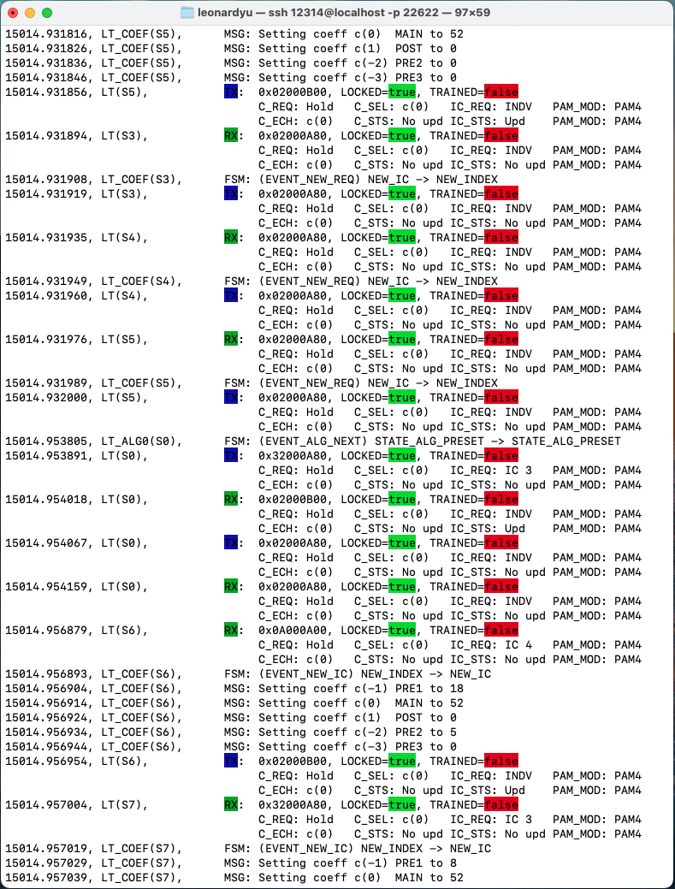

anlt log
========

Description
-----------

Show ANLT protocol trace log and save to a file.

To **quit** the continuous display mode, press :kbd:`Control-z`.

Synopsis
--------

.. code-block:: text
    
    anlt log

Arguments
---------

Options
-------

``-f, --filename`` (text)

Specifies the filename for the log messages to be stored.

``-k, --keep`` (text)
    
Specifies what types of log entries to keep, default to keep all.

Allowed values:

* `all`, to keep all.

* `an`. to keep autoneg only.

* `lt`, to keep lt only.

``-l, --lane`` (int list)
    
Specifies which lanes of LT logs to keep. If you don't know how many serdes lanes the port has, use :doc:`../an_lt/anlt_log`, default to all lanes.

Examples
--------

.. code-block:: text
    
    xoa-utils[123456][port0/2] > anlt log -f mylog.log

