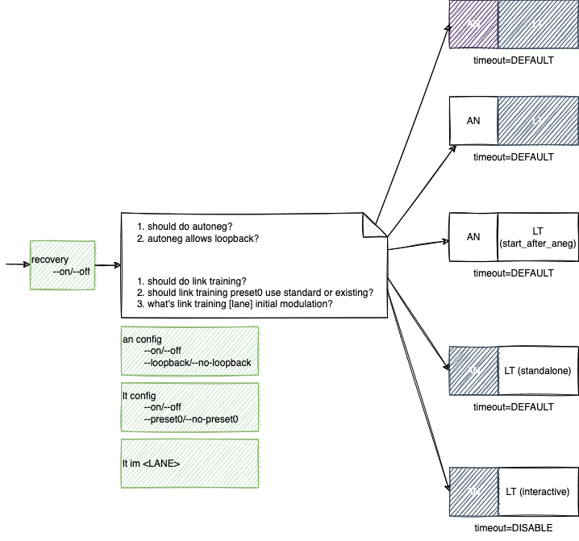

do anlt
===================

Description
-----------

To start ANLT according to the configuration from :doc:`../an/an_config`, :doc:`../lt/lt_config`, and :doc:`../lt/lt_im`

Synopsis
--------

.. code-block:: console
    
    do anlt

Arguments
---------

Options
-------

Examples
--------

.. code-block:: console

    xoa_util[port0/0]$ do anlt

    xoa_util[port0/0]$
