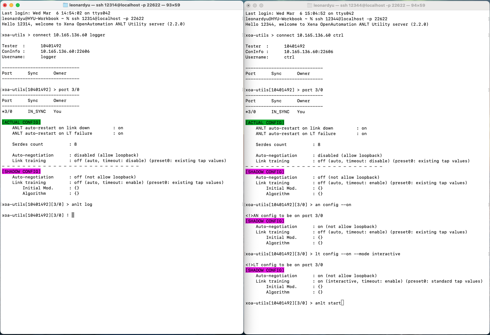
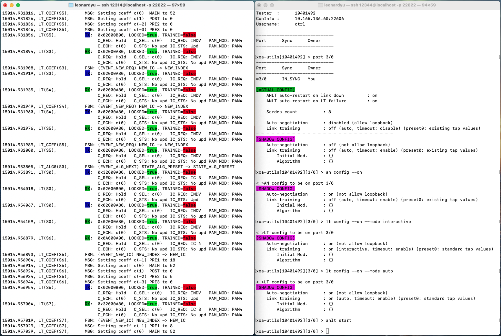

.. role:: xbluethick
.. role:: xgreenthick

Step-by-Step Guide
===================

This section provides a step-by-step guide on how to use XOA Utility to do interactive ANLT test.

The diagram below illustrates a basic flow of using XOA Utilities to do ANLT testing.

.. figure:: ../_static/anlt_use_flow.png
    :width: 100 %
    :align: center

.. note::

    ⚡️ You can use **tab key** to auto-complete a command to speed up your input speed.

.. important::

    Commands in :xgreenthick:`green blocks` instruct the tester to take action immediately.

    Commands in :xbluethick:`blue blocks` only configure the local state. You need to run ``anlt do`` to execute the configuration.

SSH to XOA Utils
----------------

After running the XOA Utils SSH Server, use another console to SSH to XOA Utils.

.. tab:: Windows
    :new-set:

    .. code-block:: doscon
        :caption: SSH to XOA Utils.

        > ssh yourname@localhost -p 22622

        Hello yourname, welcome to Xena OpenAutomation Utilities SSH Service (1.1.0).

        xoa-utils > 

.. tab:: macOS/Linux

    .. code-block:: console
        :caption: SSH to XOA Utils.

        $ ssh yourname@localhost -p 22622

        Hello yourname, welcome to Xena OpenAutomation Utilities SSH Service (1.1.0).

        xoa-utils >  

Connect
-------

First, you need to connect to your tester using the command :doc:`../cli_ref/mgmt/connect`.

If you don't know which ports you will use at the time of connecting to the port, just leave the option ``--ports`` empty as the example shows below. You can reserve ports later.

.. code-block:: text

    xoa-utils > connect 10.10.10.10 yourname

Reserve Port
------------

Then, reserve a port on the tester using the command :doc:`../cli_ref/mgmt/port`, as shown in the example below.

.. note::

    You can only work on one port at a time in one console window. If you want to simultaneously work on multiple ports, you can open multiple console windows.

.. code-block:: text

    xoa-utils[123456] > port 0/0

Start ANLT Logging
------------------

Start ANLT logging by :doc:`../cli_ref/anlt/an_lt/anlt_log`.

.. code-block:: text

    xoa-utils[123456][port0/0] > anlt log -f mylog.log

.. note::

    This commands **continuously displays** the log messages on the screen so you can keep track of your ANLT actions.
    
    To **quit** the continuous display mode, press :kbd:`Control-z`.

Use one terminal to view the ANLT protocol trace, and use another to execute ANLT commands, as shown in the screenshot below.

Disable Link Recovery
---------------------

Before doing ANLT testing, remember to disable link recovery on the port using command :doc:`../cli_ref/anlt/an_lt/anlt_recovery`.

This is because the port always tries to re-do ANLT command sequence every five seconds if it detects no sync on the port.

This will disturb your manual link training procedure if you don't disable it prior to your interactive test.

.. code-block:: text

    xoa-utils[123456][port0/0] > anlt recovery --off

Configure AN & LT
-----------------

After disabling link recovery on the port, you can start configuring AN and LT using :doc:`../cli_ref/anlt/an/an_config`, :doc:`../cli_ref/anlt/lt/lt_config`, and :doc:`../cli_ref/anlt/lt/lt_im` as the example shown below.

.. code-block:: text

    xoa-utils[123456][port0/0] > an config --off --no-loopback

    xoa-utils[123456][port0/0] > lt config --on --preset0 standard --mode interactive

    xoa-utils[123456][port0/0] > lt im 0 nrz

.. note::

    The initial modulation of each serdes on a port is by default PAM2 (NRZ). If you want to change them, you can use :doc:`../cli_ref/anlt/lt/lt_im`, otherwise do nothing.

.. important::

    :doc:`../cli_ref/anlt/an/an_config`, :doc:`../cli_ref/anlt/lt/lt_config`, and :doc:`../cli_ref/anlt/lt/lt_im` only change the local ANLT configuration state. To execute the configuration, you need to run :doc:`../cli_ref/anlt/an_lt/anlt_do`, otherwise your changes will not take effect on the tester.

Start ANLT
----------

After configuring the ANLT scenario on the port, you should execute :doc:`../cli_ref/anlt/an_lt/anlt_do` to let XOA Utilities application send low-level commands to the tester to start the ANLT procedure, either AN-only, or AN + LT, or LT (auto), or LT (interactive).

.. seealso::

    `Auto-Negotiation and Link Training Sequence <https://xenanetworks.com/whitepaper/autoneg-link-training/>`_

.. code-block:: text

    xoa-utils[123456][port0/0] > anlt do

Use one terminal to view the ANLT protocol trace, and use another to execute ANLT commands, as shown in the sreenshot below.
    

Control LT Interactive
----------------------

If you run LT (interactive), you will need to manually control the LT parameters using the LT Control Commands shown in :doc:`../cli_ref/anlt/lt/index`, for example:

.. code-block:: text

    xoa-utils[123456][port0/0] > lt preset 0 2

    xoa-utils[123456][port0/0] > lt inc 0 pre3

    xoa-utils[123456][port0/0] > lt inc 0 main

    xoa-utils[123456][port0/0] > lt dec 0 post

    xoa-utils[123456][port0/0] > lt status 0

    xoa-utils[123456][port0/0] > lt trained 0

    xoa-utils[123456][port0/0] > lt txtapget 0

    xoa-utils[123456][port0/0] > lt txtapset 0 0 0 1 56 0

Check AN Status
---------------

Check AN statistics by :doc:`../cli_ref/anlt/an/an_status`.

.. code-block:: text

    xoa-utils[123456][port0/0] > an status
    
    [ AN STATUS ]
        Loopback              : allowed
        Duration              : 2,068,747 µs
        Successful runs       : 1
        Timeouts              : 0
        Loss of sync          : 0
        FEC negotiation fails : 0
        HCD negotiation fails : 0
                                    RX    TX
        Link codewords        :      2     1
        Next-page messages    :      0     0
        Unformatted pages     :      0     0

Check LT Status
---------------

Check LT statistics by :doc:`../cli_ref/anlt/lt/lt_status`.

.. code-block:: text

    xoa-utils[123456][port0/0] > lt status 0
    
    [ LT STATUS ]
        Is enabled        : true
        Is trained        : true
        Failure           : no_failure

        Initial mod.      : nrz
        Preset0           : standard tap values
        Total bits        : 2,201,372,480
        Total err. bits   : 24
        BER               : 1.09e-08

        Duration          : 2,000,250 µs

        Lock lost         : 2
        Frame lock        : locked
        Remote frame lock : locked

        Frame errors      : 1
        Overrun errors    : 1

        Last IC received  : Preset 3
        Last IC sent      : Preset 3

        TX Coefficient              :          c(-3)       c(-2)       c(-1)        c(0)        c(1)
            Current level           :              0           0           1          44           0
                                    :         RX  TX      RX  TX      RX  TX      RX  TX      RX  TX
            + req                   :          0   0       0   0       2   2       1   1       0   0
            - req                   :          0   0       0   0       2   2       0   0       0   0
            coeff/eq limit reached  :          0   0       0   0       0   0       0   0       0   0
            eq limit reached        :          0   0       0   0       0   0       0   0       0   0
            coeff not supported     :          0   0       0   0       0   0       0   0       0   0
            coeff at limit          :          0   0       0   0       0   0       0   0       0   0

Start Over
----------

If you want to start over on the port, you can reset the port by ``port <PORT> --reset`` as shown below.

This will bring the port back to its default state.

.. code-block:: text

    xoa-utils[123456][port0/0] > port 0/0 --reset

